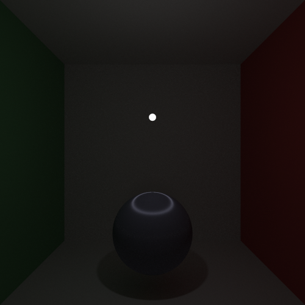
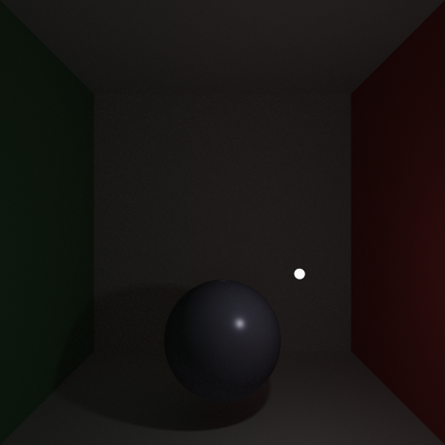

# rbrt (WIP)

a ray tracer written while reading *Physically Based Rendering*.

- [x] path integrator 

- [x] multi-threading

- [x] load obj

- [x] bvh

- [x] image texture 

- [x] microfacet model

- [ ] quasi monte carlo

- [ ] bump mapping

- [ ] mipmap

- [ ] volumn rendering

- [ ] bidirectional methods

### Current Result
1000 samples per pixel

  

  

  

  

  
  
  