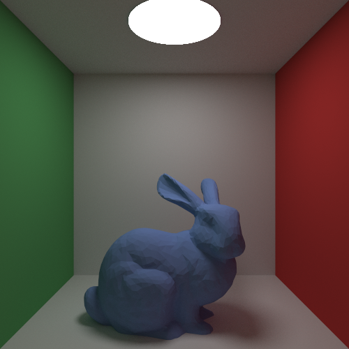

# log

- 2022-11-15
  光线加速结构
  scene::sphere_100() 创建了包含100球的cornell box
  不采用bvh的情况下，10线程，各线程20 samples per pixel，最大深度20的情况下渲染耗时10多分钟（还是1000多秒，忘了记了）

  11-15 23:59:实现了简单的bvh，同样的参数，耗时175s

- 2022-11-19
  shape和primitive都返回surfaceinteraction太怪了，本来只是用来存局部几何性质的东西，却用来存了hit_light之类与shape无关的东西

  我希望mesh只是一个几何结构，但是bvh要求里边的东西必须是primitive（这个设计应该是没有问题的，为了让bvh也包含bvh）...

  另外一个模型最好只load一次以节约内存，使用同一个mesh的不同物体使用这个mesh的引用就可以了，所以mesh仅仅实现Shape是最好的，而不是为了实现primitive而给它加上一个material，甚至加上world_to_object矩阵，这样就不能复用了。由于目前的三角形-光线求交算法是默认了在world-space进行（而不是像其它的shape求交算法那样把光线转到object-space），这要求triangle拥有一个变换矩阵，然而这种信息只能在primitive中得到，而不能在load的时候得到，因此不如仍然将光线转到object-space来进行求交...但是这样计算效率会明显降低么？三角形求交算法算是最耗时的函数了...

  pathintegrator的写法不好看，directintegrator已经很长时间没有改了...

  对于round error还没有足够鲁棒的方式来处理，目前的处理方式就仅仅是在intersect函数里边写死的t>0.0001，一定程度上能够避免self-intersect，但足够么？

  由于光源太亮了(常用的cornell box里边rgb是10.0, 10.0, 10.0, 这导致在一个像素内求spectrum的平均值的时候很容易大于spectrum(1.0, 1.0, 1.0)，结果一整个像素巨亮，和光源旁边的像素形成了鲜明对比，锯齿严重...有什么好的解决办法？HDR好像可以？合理么)

  另外，obj文件里边默认的好像都是右手坐标系，我用的是左手系，load进来后没有做处理的话就导致模型是镜像的了。

  不要再输出ppm格式图片了，尝试jpg/png？

  有没有可能实时更新渲染进度，这样debug很方便？

  暂时不要再写新东西了，把上面的问题处理得差不多吧。

  暂时的成果图(ryzen 5600g, 1000spp, 10线程渲染807s)

  